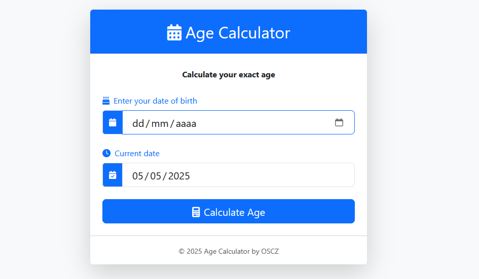

# 🧮 CALCULATE AGE

A simple mini-project that calculates a person's age based on their birth date, implemented in both JavaScript and TypeScript for comparison.



## 📁 Project Structure
1-Calculate_age/
├── js/
│ ├── index.html
│ └── init.js
├── ts/
│ ├── index.html
│ ├── dist/
│ │ ├── main.js
│ │ └── main.js.map
│ └── src/
│ └── main.ts
├── style.css
└── README.md

[⬅️ Back to Main Projects List](../README.md)

## 🛠 Technologies Used
- 
- 
- 
- 

## 🚀 Getting Started

### JavaScript Version
1. Navigate to the `js/` folder
2. Open `index.html` in your browser
3. Enter your birthdate to see your calculated age

### TypeScript Version
1. Ensure you have [Node.js](https://nodejs.org/) installed
2. Install TypeScript globally (if needed):
   ```bash
   npm install -g typescript
   ```
3. Navigate to the `ts/` folder
4. Compile the TypeScript file:
   ```bash
   tsc main.ts
   ```
5. Open `index.html` in your browser
